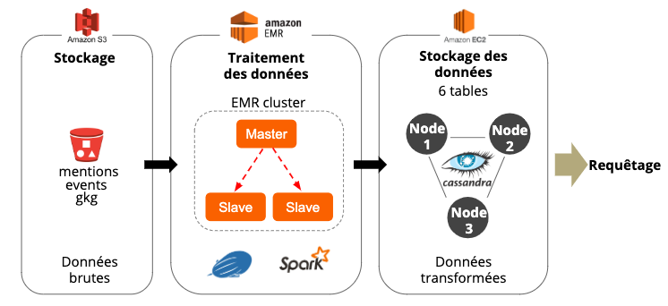

<div align='center'><h2>Projet GDELT : Mise en place d’une architecture ETL résiliente sous AWS</h2></div>

<p align='justify'>Le <a href="https://www.gdeltproject.org/">projet GDELT</a> recense les couvertures médiatiques d’évènements à travers le monde. Ce projet liste les évènements mondiaux depuis plusieurs années, et contient dans sa base des informations quant à leur couverture médiatique, c’est-à-dire les les articles citant ces événements, le ton des articles, les sujets abordés, les participants, les lieux, etc.
La base est enrichie toutes les 15 minutes.</p>  

<p align='justify'>Ce projet a été réalisé dans le cadre de notre Mastère Spécialisé Big Data à Télécom Paris. Vous trouverez le descriptif du projet <a href="http://andreiarion.github.io/projet2019.html">ici</a>.
Nous nous intéressons à la dernière année d’enrichissement de la base GDELT, et répondons aux objectifs suivants :</p>

<ul>
<li> Afficher le nombre d’articles/évènements qu’il y a eu pour chaque triplet (jour, pays de l’évènement, langue de l’article) </li>
<li> Pour un pays donné en paramètre, afficher les événements qui y ont eu lieu, triés par le nombre de mentions (tri décroissant); et permettre une agrégation par jour/mois/année</li>
<li> Pour une source de données passée en paramètre (gkg.SourceCommonName), afficher les thèmes, personnes, lieux dont les articles de cette source parlent ainsi que le nombre d’articles et le ton moyen des articles (pour chaque thème/personne/lieu); et permettre une agrégation par jour/mois/année.</li>
<li> Dresser la cartographie des relations entre les pays d’après le ton des articles : pour chaque paire (pays1, pays2), calculer le nombre d’article, le ton moyen (aggrégations sur Année/Mois/Jour, filtrage par pays ou carré de coordonnées)</li>
</ul>

<h3>1. Présentation des données</h3>

<p align='justify'>La base du projet GDELT contient plusieurs tables : dans notre cas, nous nous sommes intéressés à 3 tables : </p>

<ul>
<li> EVENTS : table qui liste les évènements mondiaux</li>
<li> MENTIONS : table qui liste les articles faisant référence à 1 évènement</li>
<li> GKG : graphe des évènements</li>
</ul>

<h3>2. Présentation de l’architecture</h3>

<p align="center">
  
</p>

<p align='justify'><b>Stockage S3</b> : Stockage des données brutes provenant des tables EVENTS, MENTIONS et GKG. Pour un an de données, ceci représente environ 460Go de données.<br></p>   
<p align='justify'><b>Amazon EMR et SPARK</b> :  Création d’un cluster EMR de 3 instances m5.xlarge (4 coeurs, 16Go RAM, 1 master et 2 slave). EMR permet de traiter de grands volumes de données à moindre coût. EMR est simple d'utilisation car l'architecture est configurée par AWS. Ce type d'outils était adaptée à notre projet en termes de calcul et de rapidité de configuration [<a href="https://aws.amazon.com/fr/emr/">Pour en savoir plus sur EMR</a>].<br></p>
<p align='justify'><b>EC2 et CASSANDRA</b> : Création d’un cluster de 3 instances EC2 de type t2.large sur lesquelles nous avons installé et configuré cassandra. Les trois instances appartiennent à la même région (us-east-1) afin de minimiser la latence de l'application. En revanche, elles appartiennent à trois zones de disponibilités différentes (us-east-1a, us-east-1b, us-east-1c) afin de permettre une haute disponibilité et d'assurer que les réplicas soient distribués uniformément sur chaque zone. Les zones de disponibilité sont reliées par des liaisons à faible latence. Ce type d'architecture était adaptée à notre projet car simple à déployer et offrant une bonne résilience en cas de panne d'une zone de disponibilité. [<a href="https://aws.amazon.com/fr/blogs/big-data/best-practices-for-running-apache-cassandra-on-amazon-ec2/">Bonnes pratiques Cassandra sur EC2</a>].<br></p>

<p align='justify'>Nous avons choisi Cassandra car c'est une base de données NoSQL open source amplement
évolutive, qui est idéale pour la gestion de grands volumes de données structurées, semi-structurées et non structurées sur plusieurs sites distribués. Elle possède une structure de données hautement efficace avec des opérations d'écriture à volume élevé. 
Elle offre une disponibilité continue sur plusieurs serveurs de commodité sans point de défaillance unique. Son  modèle de données est dynamique et puissant. Il permet des temps de réponse rapides et une flexibilité maximum.</p>

L'installation et la configuration de Cassandra sur les instances EC2 est disponible <a href="https://github.com/camillecochener/PostMasterDegree_DataScience_Projects/blob/master/ETL%20building%20for%20GDELT%20Data%20Analysis/Cassandra_configuration.md">ici</a>. 

<b>Problèmes rencontrés</b>

Au cours de notre projet, nous avons été confrontés à l'erreur suivante :

``` bash
"Timeout waiting for connection from pool (Délai d’attente de connexion du pool expiré)."
```

<p align='justify'>Ce problème est du à une limite de connexion EMRFS (Amazon EMR File System) pour Amazon S3 (Amazon Simple Storage Service). Nous l'avons résolu en recréant un cluster EMR avec options avancées. Nous avons en particulier augmenté la valeur de fs.s3.maxConnections (par défaut à 100) à 1000 en ajoutant la propriété suivante : </p>

``` bash
[
    {
      "Classification": "emrfs-site",
      "Properties": {
        "fs.s3.maxConnections": "1000",
      }
    }
 ]
```

La résolution du problème est décrite <a href="https://aws.amazon.com/fr/premiumsupport/knowledge-center/emr-timeout-connection-wait/">ici</a>.

<h3>3. ETL : Extract - Transform - Load</h3>

<p>La partie ETL du travail a été réalisée sous Zeppelin, en Scala.</p>
  
<p align='justify'>Les données brutes GDELT ont été téléchargées, stockées dans S3 (Extract), préparées (Transform) puis sauvegardées dans Cassandra (Load).</p>


<ul><b>3.1. Extract : Téléchargement des données brutes</b></ul>
  
<p align='justify'>Pour télécharger les données, et les déposer dans un bucket S3, nous avons configuré l’accès au bucket, via les credentials Amazon, contenus dans le fichier <i>credentials.csv</i> : </p>
  
``` scala
// Configuration de l'accès au bucket S3
    
val AWS_ID = "XXX"
val AWS_KEY = "XXX"
@transient val awsClient = new AmazonS3Client(new BasicAWSCredentials(AWS_ID, AWS_KEY))

sc.hadoopConfiguration.set("fs.s3a.access.key", AWS_ID) 
sc.hadoopConfiguration.set("fs.s3a.secret.key", AWS_KEY) 
sc.hadoopConfiguration.setInt("fs.s3a.connection.maximum", 3000)
```
<p align='justify'>Une fois cette configuration faite, nous avons téléchargé les fichiers "masterfilelist.txt" et "masterfilelist_translation.txt" qui contiennent la liste de tous les fichiers de données. Un fichier contient les données de 15 minutes.</p>

<p>Grâce à cette liste de fichiers, nous avons filtré les données qui nous intéressées (année 2019) puis téléchargé celles ci directement dans le bucket S3.</p>

<p>Le script complet est disponible dans le fichier <a href="https://github.com/camillecochener/PostMasterDegree_DataScience_Projects/tree/master/ETL%20building%20for%20GDELT%20Data%20Analysis/Zeppelin%20Notebook">DownloadS3.json</a>.</p>

<ul><b>3.2. Transform : Préparation des données</b></ul>

<p align='justify'>Les données brutes ont été importées depuis S3, puis converties en DataFrame Spark pour leur traitement. 
Différents DataFrames ont été créés afin de répondre aux objectifs du projet, puis persistées dans des tables Cassandra distinctes.</p>

<ul><b>3.3. Load : Stockage des données dans Cassandra</b></ul>

<p align='justify'>
Comme expliqué précédemment, chaque DataFrame a été stocké dans une table Cassandra. Ayant trois noeuds dans notre cluster Cassandra, les données ont été répliquées trois fois, avec une copie sur chaque noeud (RF=3) [<a href="https://docs.apigee.com/private-cloud/v4.17.09/about-cassandra-replication-factor-and-consistency-level">Source</a>].</p>

<p align='justify'>Le script complet relatif à la préparation des données et au stockage dans Cassandra est disponible dans le fichier <a href="https://github.com/camillecochener/PostMasterDegree_DataScience_Projects/tree/master/ETL%20building%20for%20GDELT%20Data%20Analysis/Zeppelin%20Notebook">Preparation.json</a>.</p>

<h3>4. Requêtage des données</h3>

<p align='justify'>Il est maintenant possible d'intéroger les données contenues dans les tables Cassandra pour répondre aux quatre objectifs. Les requêtes ont été écrites en Spark SQL.</p>

<p>Le script contenant les requêtes est disponible dans le fichier <a href="https://github.com/camillecochener/PostMasterDegree_DataScience_Projects/tree/master/ETL%20building%20for%20GDELT%20Data%20Analysis/Zeppelin%20Notebook">Queries.json</a>.</p>

<p>Exemple (Requête répondre à la problématique 1) :</p>


<h2>Conclusions</h2>

<p>Les différentes contraintes du projet ont été respectées :</p>

<ul>
<li> Nous avons utilisé plusieurs technologies vues en cours : Cassandra, Spark, SQL.</li>
<li> Nous avons construit un système distribué et tolérant aux pannes (le système continue de fonctionner après la perte d'un noeud).</li>
<li> Nous avons pré-chargé une année de données dans notre bucket S3. Nous avons réalisé les analyses sur un seul mois de données par manque de temps et suite à la rencontre de fichiers corrompus sur certains mois.</li>
<li> Notre cluster a été déployé sur AWS.</li>
</ul>
